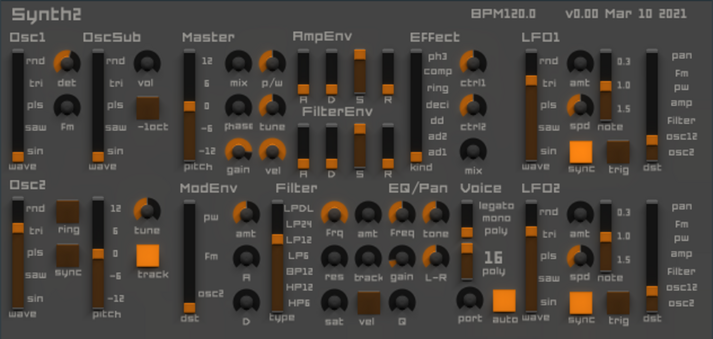

# Synth2

Simple virtual-analog synth aims to be Synth1 written in D.

WARNING: this plugin is very unstable.

## How to build this plugin?

https://github.com/AuburnSounds/Dplug/wiki/Getting-Started

## Features (TODO)

- [x] Multi-platform
  - [x] VST/VST3/AU CI build
  - [x] Windows/Linux CI test (macOS won't be tested because I don't have it)
- [ ] Oscillators
  - [x] sin/saw/square/triangle/noise waves
  - [x] 2nd/sub osc
  - [x] detune
  - [x] sync
  - [x] FM
  - [x] AM (ring)
  - [x] master control (keyshift/tune/phase/mix/PW)
  - [ ] mod envelope
- [x] Amplifier
  - [x] velocity sensitivity
  - [x] ADSR
- [x] Filter
  - [x] HP6/HP12/LP6/LP12/LP24/LPDL(TB303 like filter)
  - [x] ADSR
  - [x] Saturation
- [x] GUI
- [ ] LFO
- [ ] Arpeggiator
- [ ] Effect
- [ ] Equalizer / Pan
- [ ] Tempo Delay
- [ ] Chorus / Flanger
- [ ] Voice
- [ ] Presets
- [ ] MIDI
  - [ ] Pitch bend
  - [ ] Mod wheel
  - [ ] Control change
  - [ ] Program change

## History

- 15 Feb 2021: Fork [poly-alias-synth](https://github.com/AuburnSounds/Dplug/tree/v10.2.1/examples/poly-alias-synth).
